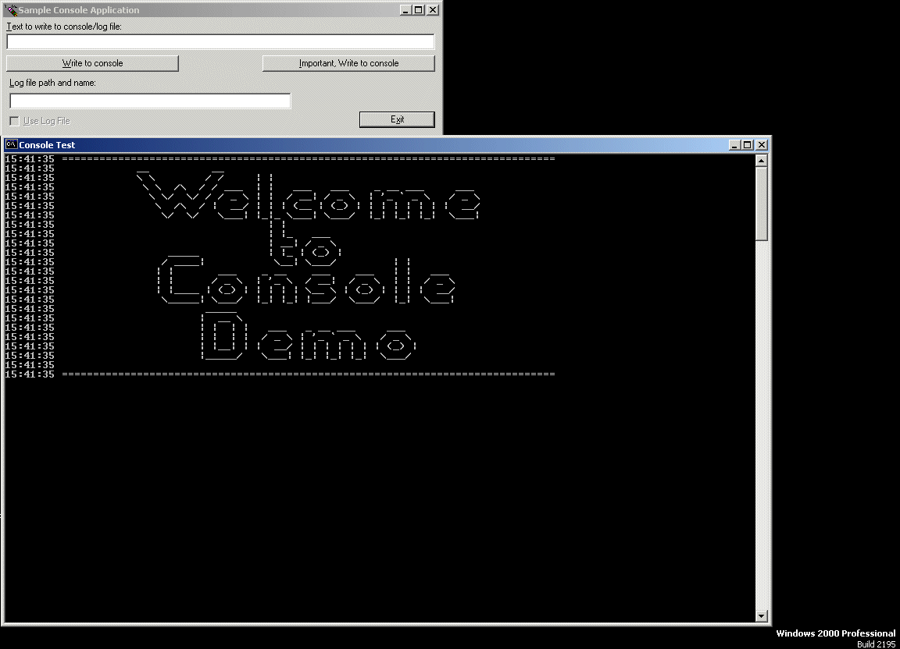



## Console Class

### Description

DOS Console class. Allowing an application to write output to a DOS console and optional log file.
 
### More Info
 

             |
---                |---
**Submitted On**   |2000-05-30 15:40:08
**By**             |[Jay Shillington](https://github.com/Planet-Source-Code/PSCIndex/blob/master/ByAuthor/jay-shillington.md)
**Level**          |Beginner
**User Rating**    |4.8 (29 globes from 6 users)
**Compatibility**  |VB 5\.0, VB 6\.0
**Category**       |[Files/ File Controls/ Input/ Output](https://github.com/Planet-Source-Code/PSCIndex/blob/master/ByCategory/files-file-controls-input-output__1-3.md)
**World**          |[Visual Basic](https://github.com/Planet-Source-Code/PSCIndex/blob/master/ByWorld/visual-basic.md)
**Archive File**   |[CODE\_UPLOAD62405302000\.zip](https://github.com/Planet-Source-Code/jay-shillington-console-class__1-8469/archive/master.zip)

